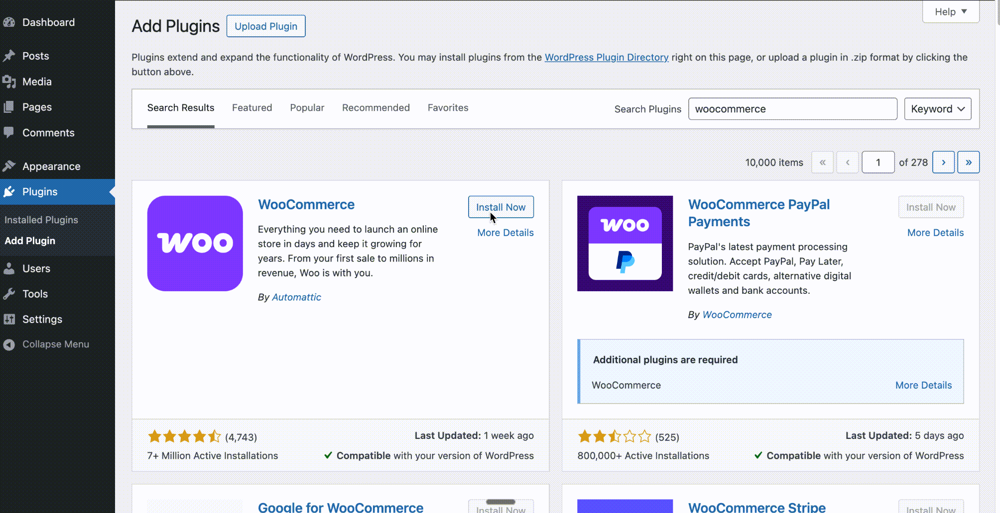
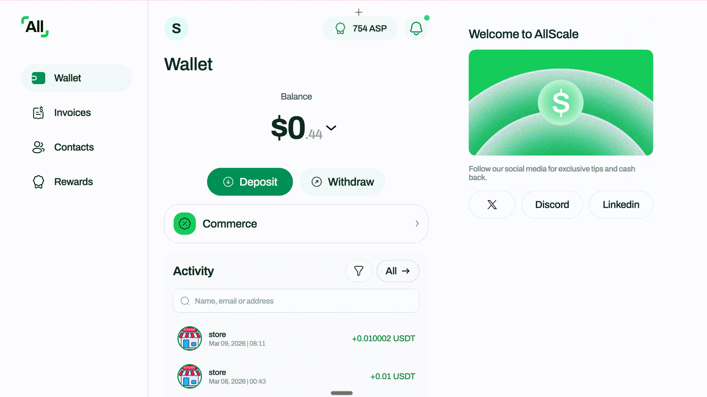

# Allscale Checkout for WooCommerce (Beta)

> **Community beta** — This plugin is developed by the AllScale community and is not an official release. Your assets are always safe thanks to Allscale's non-custodial design: payments go directly to your wallet and are never held by a third party.

A WordPress/WooCommerce payment gateway plugin that lets merchants accept crypto payments via [Allscale Checkout](https://allscale.io). Prices are displayed in your store's local currency, and funds settle instantly as **USDT stablecoin** directly to the merchant's wallet.

## Why Allscale?

- **Non-custodial** — Funds go straight to your wallet. No platform holds your money.
- **Low fees** — 0.5% per transaction (vs ~3-5% on traditional processors).
- **Instant settlement** — On-chain USDT, no waiting days for payouts.
- **No account freezes** — Your funds are on-chain and always accessible.
- **Permissionless setup** — Self-custodial, so you can start accepting payments right away.

## How It Works

1. Customer places an order on your WooCommerce store and selects "Pay with Allscale".
2. The plugin creates a checkout intent via the Allscale API.
3. Customer is redirected to a hosted Allscale checkout page to complete payment using their Allscale account or a crypto wallet (MetaMask, Trust Wallet, etc.).
4. Payment confirms on-chain and the order is updated automatically.
5. The WooCommerce order is marked as paid and the customer sees a confirmation.

### How payment confirmation works

The plugin uses two methods to confirm payments, so orders are updated reliably:

- **Webhook (server-to-server):** Allscale sends a signed notification directly to your server when payment is confirmed on-chain. This is the primary method and works even if the customer closes their browser after paying. Requires configuring the webhook URL in your Allscale dashboard (see [Step 4](#step-4-set-up-the-webhook) in the setup guide).

- **Return URL check (fallback):** When the customer is redirected back to your store's "thank you" page after paying, the plugin calls the Allscale API to check the payment status. If the payment is confirmed, the order is updated immediately — so the customer sees "Payment complete" right away, even if the webhook hasn't arrived yet.

Both methods are active by default. The return URL check ensures a good customer experience (instant confirmation on the thank-you page), while the webhook ensures no payment is missed (covers cases where the customer closes their browser before returning).

## Features

- **WooCommerce payment gateway** — Shows up as a payment option at checkout.
- **Automatic order management** — Orders update in real time based on payment status.
- **Webhook verification** — Cryptographically verifies all incoming webhook notifications (HMAC-SHA256).
- **Sandbox mode** — Test the full flow without real transactions.
- **Currency auto-detection** — Automatically uses your WooCommerce store currency for pricing.
- **Secure by design** — All API signing done server-side, timing-safe signature comparison.

## Requirements

- WordPress 5.8+
- WooCommerce 6.0+
- PHP 7.4+
- A free [Allscale account](https://allscale.io) with Commerce enabled

> **First time?** [Sign up at allscale.io](https://allscale.io) — it takes a couple of minutes. Allscale is non-custodial, charges only 0.5% per transaction (vs 3-5% on traditional processors), and settles instantly as USDT to your own wallet. No account freezes, no waiting for payouts.

## Installation

1. [Download the ZIP](../../archive/refs/heads/main.zip) from GitHub (or click **Code → Download ZIP** on the repo page).
2. In your WordPress admin, go to **Plugins → Add New → Upload Plugin**.
3. Upload the ZIP file and click **Install Now**.
4. Click **Activate**.



That's it — the plugin is now installed. Follow the [Setup Guide](#setup-guide) below to configure it.

## Setup Guide

### Step 1: Get your Allscale API credentials

1. Create an account at [allscale.io](https://allscale.io).
2. Enable **Allscale Commerce** in your dashboard.
3. Create a **Store** and configure your USDT receiving wallet address.
4. Generate an **API Key** and **API Secret** (the secret is shown only once — save it).

### Step 2: Enable the payment gateway in WooCommerce

1. In your WordPress admin, go to **WooCommerce → Settings** in the left sidebar.
2. Click the **Payments** tab.
3. Find **Allscale Checkout** in the list of payment providers and click **Enable**, then **Manage**.

> **Tip:** You can also get there from **Plugins → Installed Plugins** and clicking the **Settings** link under Allscale Checkout.


### Step 3: Configure the plugin

1. Enter your **API Key** and **API Secret** from Step 1.
2. Select your **Environment** (Sandbox for testing, Production for live payments).
3. Click **Save changes**.

### Step 4: Set up the webhook

1. Copy the **Webhook URL** shown at the bottom of the plugin settings page. It looks like:
   ```
   https://yoursite.com/wc-api/allscale_checkout
   ```
2. In your Allscale dashboard, go to **Commerce** and paste this URL as your store's webhook endpoint.



That's it — your store is now accepting crypto payments.

## Refunds

Allscale is a **non-custodial** payment solution — funds settle directly to your wallet, not to a platform account. Because of this, automatic refunds via the WooCommerce order screen are not supported.

To refund a customer:

1. Send the refund amount back to the customer manually from your wallet.
2. In WooCommerce, go to the order and update the status to **Refunded**.

Your assets are always safe and under your control — no third party can freeze, hold, or reverse your funds.

## Abandoned Orders and Stock

If a customer starts checkout but never completes payment on Allscale, the order stays as "Pending payment." WooCommerce automatically cancels unpaid pending orders and restores stock based on your **Hold stock** setting:

**WooCommerce → Settings → Products → Inventory → Hold stock (minutes)**

The default is 60 minutes. After that time, unpaid orders are cancelled and any reserved stock is released. No action needed from you.

## Development

```bash
# Clone the repo
git clone https://github.com/allscale-io/allscale-checkout-woocommerce.git
cd allscale-checkout-woocommerce

# For local WordPress development, symlink into your plugins directory
ln -s $(pwd) /path/to/wordpress/wp-content/plugins/allscale-checkout
```

## License

GPLv2 or later — see [LICENSE](LICENSE) for details.

## Links

- [Allscale Website](https://allscale.io)
- [Allscale API Documentation](https://github.com/allscale-io/allscale-checkout-skill)
- [WooCommerce Payment Gateway API](https://woocommerce.com/document/payment-gateway-api/)
